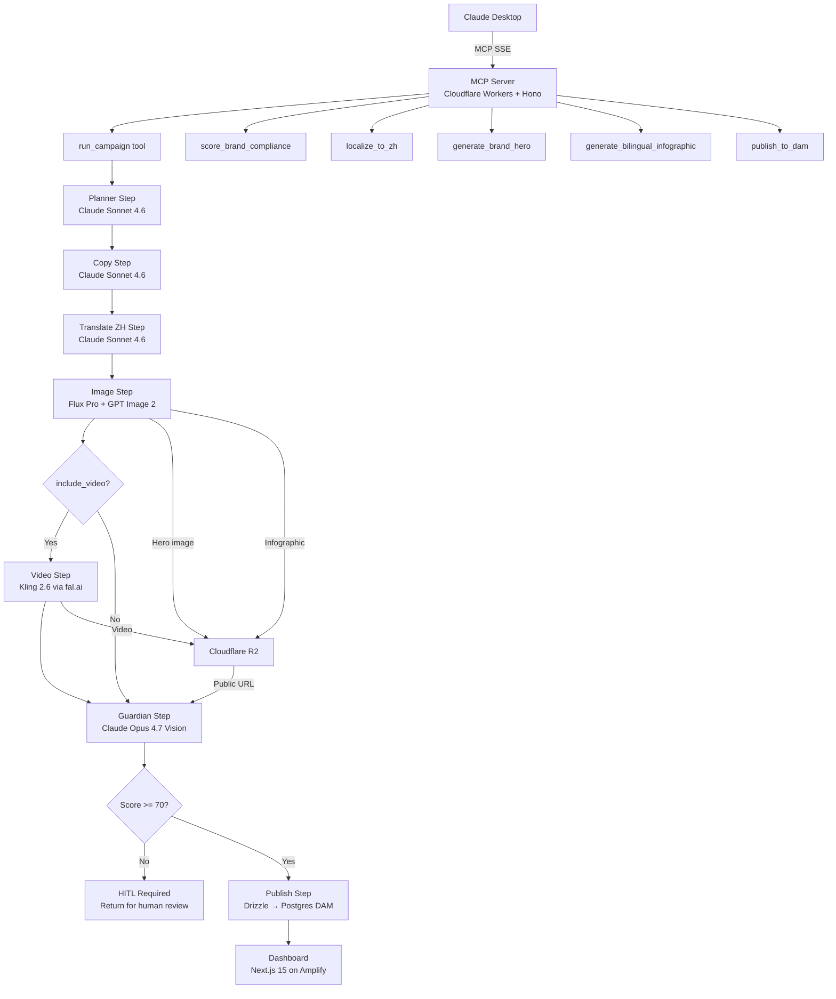

# FF Brand Studio — MCP Edition

AI-powered bilingual marketing content generation for Faraday Future.
Generates EN/ZH hero images, infographics, LinkedIn/Weibo copy, and video assets — scored against brand guidelines — directly inside Claude Desktop.

> **Status (2026-04-28):** v2 SaaS pivot complete. Phases G–O ✅ live.
> Multi-tenant, self-serve, machine-callable. See `SESSION_STATE.md`
> for the current state in 5 minutes.

---

## What's where

| Folder | Purpose |
|---|---|
| `apps/mcp-server/` | Cloudflare Worker — `/v1/*` REST + `/sse` MCP. Phase G–O backend. Hono + Drizzle + zod. |
| `apps/dashboard/` | Next.js 15 static export deployed to Cloudflare Pages. 10 routes incl. `/library`, `/launch`, `/settings`. |
| `apps/image-sidecar/` | Node + sharp service on AWS App Runner — kind-aware crops, SVG composites, banner extends, white-bg force. Phase I sidecar (sharp can't run in Workers). |
| `apps/proxy-worker/` | Tiny edge router — historical. |
| `packages/types/` | Zod schemas + types. Source-of-truth re-exported by all consumers. |
| `packages/brand-rules/` | Brand voice + per-platform SEO rubric (Amazon US, Tmall, JD, Shopify). |
| `packages/seo-clients/` | DataForSEO + Apify wrappers. |
| `packages/media-clients/` | fal.ai + OpenAI + Anthropic + R2 SDK helpers. |
| `plans/` | Per-phase plans (`active-plan-saas-G.md` … `-M.md`) + master `saas-iteration-plan.md`. |
| `docs/adr/` | ADRs. 0003 = image pipeline runtime split. |
| `docs/RUNBOOK_*.md` | Activation playbooks: Phase I spike, feature flags, secret rotation. |
| `.github/workflows/` | CI, deploy, sidecar build (ECR), daily Postgres dump, synthetic check. |

---

## Architecture



## Workspace Structure

```
FF-Brand-Studio/
├── packages/
│   ├── types/          # @ff/types — Zod schemas for all tool I/O
│   ├── brand-rules/    # @ff/brand-rules — ff-brand-rules.yaml + scoring helpers
│   └── media-clients/  # @ff/media-clients — fal.ai, OpenAI, R2, Anthropic wrappers
├── apps/
│   ├── mcp-server/     # ff-mcp-server — Cloudflare Workers MCP server
│   │   └── src/
│   │       ├── tools/          # 6 MCP tools
│   │       ├── workflows/      # Campaign orchestration pipeline
│   │       ├── guardian/       # Brand Guardian (Claude Opus 4.7 vision)
│   │       ├── db/             # Drizzle schema + client
│   │       └── lib/            # Langfuse singleton
│   └── dashboard/      # ff-dashboard — Next.js 15 asset + cost dashboard
├── scripts/
│   ├── schema.sql      # Postgres DDL — run once manually
│   └── demo-run.ts     # End-to-end demo (bypasses Claude Desktop)
└── plans/
    └── active-plan.md  # Step-by-step build plan with acceptance criteria
```

## MCP Tools

| Tool | Description |
|------|-------------|
| `run_campaign` | Full pipeline: plan → copy → translate → image → (video) → score → publish |
| `generate_brand_hero` | Flux Pro photoreal hero image, uploaded to R2 |
| `generate_bilingual_infographic` | GPT Image 2 bilingual infographic, uploaded to R2 |
| `localize_to_zh` | Two-pass Claude Sonnet translation (translate + native editor review) |
| `score_brand_compliance` | Claude Opus 4.7 vision scoring against FF brand guidelines |
| `publish_to_dam` | Insert asset record to Postgres DAM, return platform preview |

## Campaign Pipeline

```
source_text
    → Planner (Claude Sonnet) → 3 key points + EN drafts
    → Copy (Claude Sonnet)    → refined EN LinkedIn/Weibo posts
    → Translate (Claude Sonnet) → ZH LinkedIn/Weibo posts
    → Image (Flux + GPT Img2)  → hero image + infographic → R2
    → Video (Kling, optional)  → video asset → R2
    → Guardian (Claude Opus)   → brand scorecard per asset
    → HITL check (score < 70)  → return for human review OR publish
    → Publish (Drizzle)        → Postgres DAM + platform previews
```

## Brand Guardian Scoring

Scores each asset 0-100 across 5 dimensions:

| Dimension | Weight |
|-----------|--------|
| Color compliance (#1C3FAA, #00A8E8, #C9A84C palette) | 20% |
| Typography (Maison Neue EN, Source Han Sans SC ZH) | 20% |
| Logo placement (top-left / bottom-center / bottom-right) | 15% |
| Image quality (studio-grade, no blur/artifacts) | 25% |
| Copy tone (aspirational, no "cheap/discount/sale") | 20% |

- **85+**: Auto-approved
- **70-84**: Passes brand review
- **< 70**: HITL required — returns `status: "hitl_required"` with full scorecards

## Setup

### Prerequisites

1. Cloudflare account with Workers + R2 + KV access
2. fal.ai account (Flux Pro + Kling) — get key at fal.ai
3. OpenAI account with org verification for GPT Image 2
4. Langfuse cloud account (free tier at cloud.langfuse.com)
5. Postgres 15 on existing server — create database `ff_brand_studio`

### 1. Create Postgres database

```bash
psql -h 170.9.252.93 -p 5433 -U postgres -c "CREATE DATABASE ff_brand_studio;"
psql -h 170.9.252.93 -p 5433 -U postgres -d ff_brand_studio -f scripts/schema.sql
```

### 2. Create Cloudflare resources

```bash
# R2 bucket
wrangler r2 bucket create ff-brand-studio-assets
# Enable public access in Cloudflare dashboard → R2 → ff-brand-studio-assets → Settings → Public Access

# KV namespace
wrangler kv namespace create SESSION_CACHE
# Copy the ID into wrangler.toml [[kv_namespaces]] id field
```

### 3. Configure environment

```bash
cp .env.example .env
# Fill in all values in .env
```

### 4. Set Cloudflare secrets

```bash
cd apps/mcp-server
wrangler secret put ANTHROPIC_API_KEY
wrangler secret put OPENAI_API_KEY
wrangler secret put FAL_KEY
wrangler secret put PGHOST
wrangler secret put PGPORT
wrangler secret put PGDATABASE
wrangler secret put PGUSER
wrangler secret put PGPASSWORD
wrangler secret put LANGFUSE_PUBLIC_KEY
wrangler secret put LANGFUSE_SECRET_KEY
wrangler secret put R2_PUBLIC_URL
```

### 5. Install dependencies and deploy

```bash
pnpm install
pnpm type-check
pnpm --filter ff-mcp-server run deploy
```

### 6. Configure Claude Desktop

Copy `claude_desktop_config.template.json`, fill in your Workers URL, and place at:
- **Mac**: `~/Library/Application Support/Claude/claude_desktop_config.json`
- **Windows**: `%APPDATA%\Claude\claude_desktop_config.json`

### 7. Deploy dashboard

```bash
# In AWS Amplify console:
# 1. Connect this repo
# 2. Set build spec: use apps/dashboard/amplify.yml
# 3. Add environment variables (FF_PGHOST, FF_PGPASSWORD, etc.)
# 4. Deploy
```

## Local Development

```bash
# Start MCP server locally (Wrangler dev)
pnpm --filter ff-mcp-server dev

# Start dashboard locally
pnpm --filter ff-dashboard dev

# Run end-to-end demo (requires .env)
pnpm tsx scripts/demo-run.ts

# Type check all packages
pnpm type-check
```

## Decision Log

| Decision | Rationale |
|----------|-----------|
| Cloudflare Workers (not Vercel) | Existing CreatoRain account, no cold start for SSE |
| Postgres at 170.9.252.93 (not new DB) | Reuse existing infra, no new managed DB cost |
| Claude Sonnet 4.6 for copy/translate | Cost-effective, EN→ZH quality sufficient |
| Claude Opus 4.7 for guardian | Vision quality essential for brand scoring |
| Plain TypeScript pipeline (not Mastra DSL) | Mastra's `Workflow` API was too experimental; TS pipeline is type-safe and debuggable |
| fal.ai polling for Kling video | Kling jobs take 30-90s — polling is the correct async pattern |
| GPT Image 2 for infographics | Best in class for text-in-image bilingual layouts |
| HITL at score < 70 | Aligns with FF brand-rules.yaml `pass_threshold: 70` |
