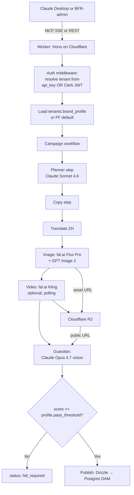

# FF Brand Studio — Multi-tenant AI brand-content generation

Multi-tenant AI service for bilingual EN/ZH marketing content
generation, scored against per-tenant brand guidelines. Cloudflare
Worker (MCP + REST) + Next.js dashboard.

> **Status (2026-06-01):** v2 multi-tenant pivot complete. Brand identity
> is data-driven via `tenants.brand_profile` (Phase 1). Consumable from
> Claude Desktop (MCP/SSE), from any HTTP client (`/v1/*` REST), and
> from sibling services like `buyfishingrod-admin` (under
> `FF_MIGRATE_*` flags — see Phase 2 of `Claude_Code_Context/BFR_ECOSYSTEM_PLAN.md`).
>
> The project originated as a 7-day interview deliverable scoped to the
> Faraday Future brand. That hardcoded constraint has been refactored
> out: FF lives on as the **default fallback brand profile**, so any
> tenant without an explicit `brand_profile` row produces FF-flavored
> output — a deliberately visible regression rather than a silent
> breakage. See `apps/mcp-server/src/lib/brand-profile.ts` for the
> shape and resolver.

---

## Who calls this service

| Caller | Path | Auth |
|---|---|---|
| Claude Desktop (MCP) | `/sse` (SSE transport) | `ff_live_*` api_key in header (Phase 1 P1.9 — anonymous calls rejected) |
| `buyfishingrod-admin` | `/v1/launches`, `/v1/products`, `/v1/integrations`, `/v1/tenants/me/brand-profile` | `FF_STUDIO_API_KEY` (tenant-scoped `ff_live_*`) + `X-Request-ID` for trace correlation (Phase 2 P2.9) |
| The dashboard (Next.js Pages app) | `/v1/*` REST | Clerk session JWT (preferred) OR `?ff_api_key=ff_live_*` URL fallback |
| Direct curl / scripts | `/v1/*` REST | `ff_live_*` Bearer token |

The dashboard has a known recurring bug class around Clerk JWT
templates being mis-configured per Clerk instance — being addressed in
Phase 7 follow-up by dropping the `org_id` JWT-claim requirement and
deriving the org server-side from the authenticated `sub`. Until that
ships, the `?ff_api_key=ff_live_*` URL fallback is a reliable bypass.

---

## Architecture



Every prompt is rendered from the **tenant's `brand_profile`** —
guardian system prompt (`formatProfileForGuardian`), hero image prompt
(`formatProfileForImagePrompt`), video prompt brand line, copy
planner's tone descriptors and forbidden words. See ADR 0001 in
`Claude_Code_Context/docs/adr/0001-tenant-brand-profile-jsonb.md`.

## Repo layout

| Folder | Purpose |
|---|---|
| `apps/mcp-server/` | Cloudflare Worker — `/v1/*` REST + `/sse` MCP. Hono + Drizzle + zod. The whole backend. |
| `apps/dashboard/` | Next.js 15 static export → Cloudflare Pages. Library, launches, settings, brand-profile editor. |
| `apps/image-sidecar/` | Node + sharp on AWS App Runner — crops, composites, banner extends, white-bg force. Sharp can't run in Workers. |
| `apps/proxy-worker/` | Tiny edge router — historical, kept for one legacy path. |
| `packages/types/` | `@ff/types` — zod schemas re-exported by every consumer. |
| `packages/brand-rules/` | The default FF brand profile (now used only as the fallback for tenants without their own `brand_profile`). |
| `packages/seo-clients/` | DataForSEO + Apify wrappers. |
| `packages/media-clients/` | fal.ai + OpenAI + Anthropic + R2 SDK helpers. |
| `plans/` | Historical per-phase plans (interview-mode phases A–F, then SaaS phases G–O). New work tracked in the top-level `Claude_Code_Context/BFR_ECOSYSTEM_PLAN.md`. |
| `docs/adr/` | ADRs. 0003 = image pipeline runtime split (Workers vs sidecar). |
| `docs/RUNBOOK_*.md` | Activation playbooks: secret rotation, feature flags. |
| `.github/workflows/` | CI, deploy, sidecar build (ECR), nightly Postgres dump, synthetic check. |

## REST surface (the parts BFR-admin touches)

| Method | Path | Purpose |
|---|---|---|
| GET | `/v1/tenants/me/brand-profile` | Read the current tenant's brand profile (or the FF default if unset) |
| PATCH | `/v1/tenants/me/brand-profile` | Update — onboarding path for a new brand (BFR, CERON, etc.) |
| POST | `/v1/launches` | Trigger a full campaign workflow (planner → copy → translate → image → guardian → publish) |
| POST | `/v1/integrations` | Register a webhook destination. SSRF-guarded — non-https / RFC1918 / metadata / private TLDs are rejected (Phase 6 P6.8) |
| POST | `/v1/products/upload-intent` | Pre-signed R2 upload intent for a product image. **Currently fails on missing `org_id` JWT claim — see Phase 7 follow-up.** |

MCP-only tools (Claude Desktop):
- `run_campaign`, `generate_brand_hero`, `generate_bilingual_infographic`, `localize_to_zh`, `score_brand_compliance`, `publish_to_dam`.

Some MCP tools (`generate_bilingual_infographic`, `generate_brand_hero`, `localize_to_zh`, `pipeline/composite.ts`) still hardcode FF brand — deferred. The campaign workflow that BFR/Ceron use is fully tenant-aware.

## Brand Guardian scoring

Per-tenant scoring across 5 dimensions. Weights live in the tenant's
`brand_profile` (defaults match the FF profile for legacy compatibility):

| Dimension | Default weight | Source field |
|---|---|---|
| Color compliance | 20% | `palette.primary`, `palette.neutrals`, `palette.accent` |
| Typography | 20% | `fonts.heading`, `fonts.body` |
| Logo placement | 15% | (heuristic) |
| Image quality | 25% | (heuristic) |
| Copy tone | 20% | `tone`, `forbidden_words`, `exclamation_rule` |

Threshold per-tenant via `brand_profile.pass_threshold` (default 70).
HITL fires below threshold.

## Setup

### Prerequisites

1. Cloudflare account with Workers + R2 + KV
2. fal.ai account (Flux Pro + Kling)
3. OpenAI account with org verification for GPT Image 2
4. Anthropic API key (Claude Sonnet 4.6 + Opus 4.7)
5. Langfuse cloud (free tier OK)
6. Postgres 15 — shared host `170.9.252.93:5433`, database `ff_brand_studio`

### 1. Postgres

```bash
psql -h 170.9.252.93 -p 5433 -U postgres -c "CREATE DATABASE ff_brand_studio;"
psql -h 170.9.252.93 -p 5433 -U postgres -d ff_brand_studio -f scripts/schema.sql
# Phase 1 migration adds brand_profile JSONB:
psql -h 170.9.252.93 -p 5433 -U postgres -d ff_brand_studio -f drizzle/0027_tenant_brand_profile.sql
```

### 2. Cloudflare

```bash
wrangler r2 bucket create ff-brand-studio-assets
# Enable public access in Cloudflare dashboard → R2 → ff-brand-studio-assets → Settings → Public Access
wrangler kv namespace create SESSION_CACHE
# Copy the ID into wrangler.toml [[kv_namespaces]] id field
```

### 3. Env

```bash
cp .env.example .env
# Fill in all values
```

### 4. Worker secrets

```bash
cd apps/mcp-server
wrangler secret put ANTHROPIC_API_KEY
wrangler secret put OPENAI_API_KEY
wrangler secret put FAL_KEY
wrangler secret put PGHOST
wrangler secret put PGPORT
wrangler secret put PGDATABASE
wrangler secret put PGUSER
wrangler secret put PGPASSWORD
wrangler secret put LANGFUSE_PUBLIC_KEY
wrangler secret put LANGFUSE_SECRET_KEY
wrangler secret put R2_PUBLIC_URL
wrangler secret put CLERK_SECRET_KEY     # Phase 7 follow-up — for server-side org resolution
```

### 5. Install + deploy

```bash
pnpm install
pnpm type-check
pnpm --filter ff-mcp-server run deploy
```

### 6. Claude Desktop (optional, only if you want MCP)

Copy `claude_desktop_config.template.json`, fill in your Workers URL,
and place at:
- **Mac**: `~/Library/Application Support/Claude/claude_desktop_config.json`
- **Windows**: `%APPDATA%\Claude\claude_desktop_config.json`

### 7. Dashboard (Cloudflare Pages)

```bash
wrangler pages deploy apps/dashboard/out --project-name ff-brand-studio
```

Set Pages env vars:
- `NEXT_PUBLIC_API_BASE` = your Worker URL
- `NEXT_PUBLIC_CLERK_PUBLISHABLE_KEY`
- Optional: `NEXT_PUBLIC_FALLBACK_API_KEY` for `?ff_api_key=` fallback

## Local development

```bash
pnpm --filter ff-mcp-server dev      # wrangler dev on port 8787
pnpm --filter ff-dashboard dev       # next dev on port 3002
pnpm tsx scripts/demo-run.ts         # end-to-end without Claude Desktop
pnpm type-check                      # all packages
```

## Onboarding a new brand

1. POST a tenant row (or use the existing CreatoRain admin onboarding flow).
2. Authenticate as that tenant.
3. `PATCH /v1/tenants/me/brand-profile` with the brand's palette, fonts,
   tone, forbidden words, threshold. See
   `apps/mcp-server/src/lib/brand-profile.ts` for the typed shape.
4. Verify by triggering `POST /v1/launches` and inspecting the
   guardian scorecard — it must reference your palette, not FF blue.

## Cross-references

- Top-level ecosystem plan: `../creatorain/Claude_Code_Context/BFR_ECOSYSTEM_PLAN.md`
- Architecture overview: `../creatorain/Claude_Code_Context/ARCHITECTURE.md`
- ADRs: `../creatorain/Claude_Code_Context/docs/adr/` (0001 brand profile, 0002 storefront monorepo, 0003 queue choice, 0004 staff SSO)
- Handoff doc (env setup, deploy gotchas): `HANDOFF.md` at repo root
- Working agreement for Claude: `CLAUDE.md` at repo root (still has interview-mode language — refresh in a separate follow-up)
